<div align="center">
  
</div>

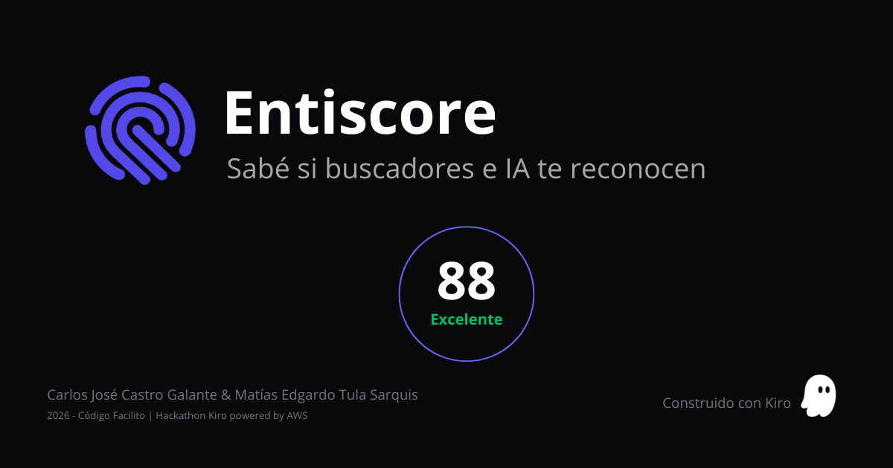

# Entiscore

Auditor de entidad digital. Analiza tu presencia online y genera un reporte accionable sobre qué tan reconocible eres para buscadores e inteligencia artificial.

**Demo en producción:** https://entiscore.vercel.app

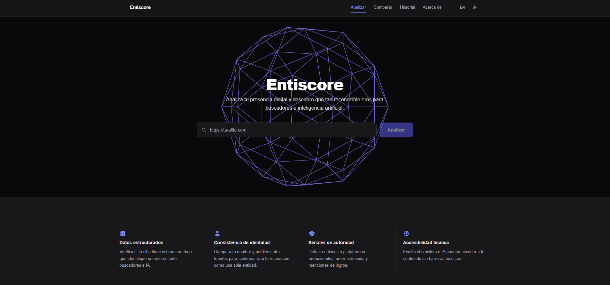

---

## Qué es Entiscore

Entiscore es un agente que recibe la URL de un portfolio personal, perfil profesional o sitio web, y devuelve un reporte claro sobre qué tan reconocible es esa persona o proyecto como una entidad legítima para motores de búsqueda y sistemas de inteligencia artificial.

### El problema que resuelve

Hoy no existe una herramienta simple y gratuita para auditar la presencia digital propia desde la perspectiva de cómo la interpretan los sistemas automatizados. La información sobre schema markup, SEO técnico y construcción de entidad digital está dispersa, es técnica, y no está pensada para que alguien sin conocimiento profundo pueda entender qué le falta a su propia presencia ni por qué importa.

### A quién está dirigido

A cualquier profesional con presencia online que quiera entender y mejorar cómo lo interpretan los buscadores y los sistemas de inteligencia artificial. No solo desarrolladores: cualquier persona con un portfolio, un perfil profesional o un sitio propio.

### Contexto del proyecto

Entiscore nació como parte del hackathon Kiro powered by AWS organizado por Código Facilito, pero está pensado para seguir existiendo más allá de esa instancia, como una herramienta de uso real y continuo.

---

## Los cuatro ejes de análisis

Entiscore evalúa cada sitio a través de cuatro dimensiones complementarias que, en conjunto, determinan la madurez de la entidad digital.

### Datos estructurados

Verifica la presencia y calidad de schema markup en el sitio analizado. Detecta JSON-LD, Microdata y RDFa, identifica los tipos declarados (Person, Organization, WebSite, ProfilePage), y evalúa la completitud de los campos obligatorios y recomendados según las especificaciones de schema.org.

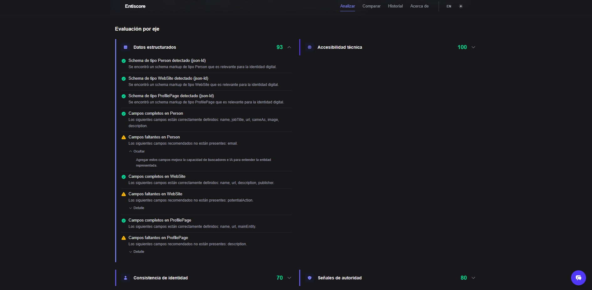

### Consistencia de identidad

Compara el nombre y la información del titular entre las distintas fuentes disponibles: el campo name del schema markup, el og:title, la etiqueta title del HTML, y los perfiles externos declarados en el array sameAs del JSON-LD o enlazados como anclas en el cuerpo. Verifica la accesibilidad real de cada perfil externo detectado.

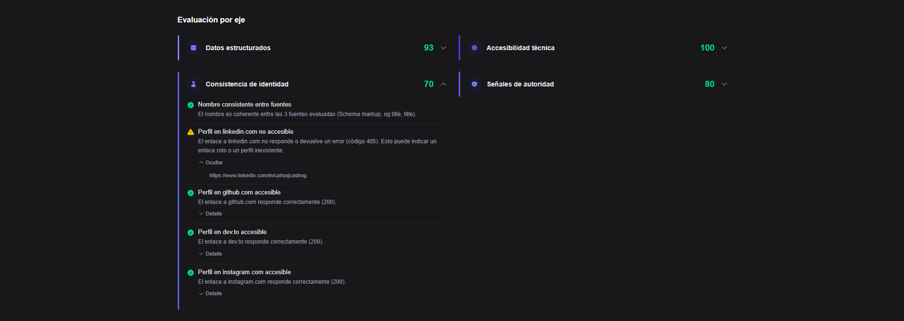

### Señales de autoridad

Detecta enlaces salientes hacia plataformas de autoridad reconocidas (GitHub, LinkedIn, Medium, Dev.to, Speaker Deck, YouTube, entre otras), evalúa la presencia de metadata de autoría, fechas de publicación, y busca en el contenido textual menciones explícitas de logros, certificaciones, conferencias o contribuciones open source.

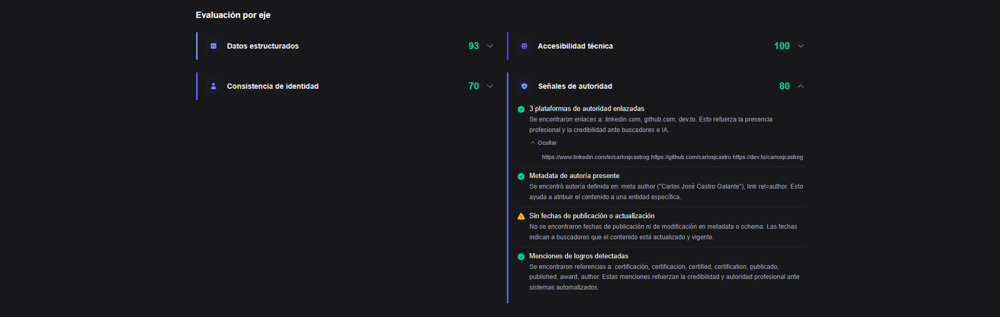

### Accesibilidad técnica

Evalúa si el sitio es técnicamente accesible para crawlers: código de respuesta HTTP, tiempo de respuesta, presencia de metadatos esenciales (title, meta description, Open Graph tags), análisis del robots.txt, y detección de sitios SPA que dependen exclusivamente de JavaScript del lado del cliente.

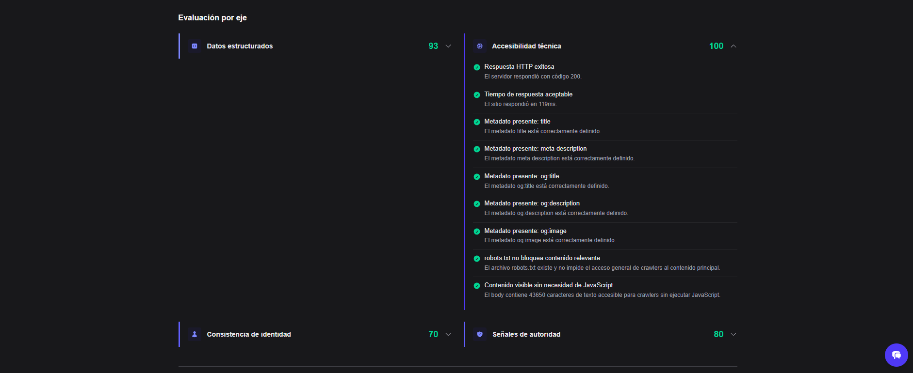

---

## Funcionalidades completas

### Análisis individual

- Ingreso de una URL y generación de un reporte completo con puntaje general (0 a 100) y nivel de madurez (bajo, medio, alto, excelente).
- Resumen ejecutivo generado por Claude AI describiendo el estado general, fortalezas y áreas de mejora en un párrafo claro y no técnico.
- Hallazgos específicos agrupados por cada uno de los cuatro ejes, con findings positivos, de advertencia y críticos.
- Plan de acción priorizado generado por IA con recomendaciones concretas, nivel de esfuerzo estimado, y snippets de código de solución expandibles por cada hallazgo (JSON-LD, meta tags, fragmentos HTML).
- Visualización del grafo de entidad digital detectado, representando las conexiones entre el sitio, sus schemas, perfiles externos y plataformas de autoridad.
- Captura automática del favicon y nombre del sitio analizado.
- Score animado con indicador circular de progreso.

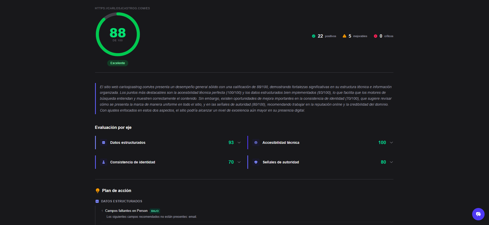

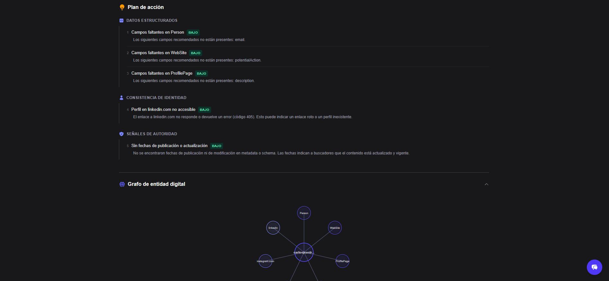

### Comparación entre dos URLs

- Análisis en paralelo de dos sitios distintos con un solo click.
- Resumen comparativo indicando cuál obtuvo mejor resultado en cada eje.
- Vista lado a lado en desktop con los reportes completos de ambos sitios.
- Narración en vivo del progreso de ambos análisis identificados por hostname.

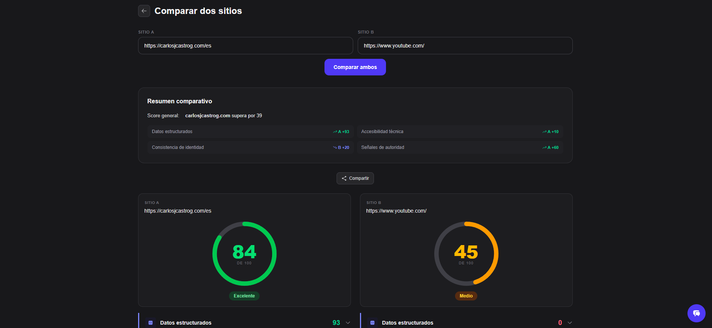

### Historial de análisis

- Registro automático de cada análisis realizado (solo si el usuario aceptó cookies).
- Lista de entradas con URL, fecha, score y nivel de madurez.
- Exportación a JSON y a PDF con reporte completo legible.
- Opción de repetir análisis con un click.
- Eliminación individual o vaciado completo del historial.
- Comparación de scores entre análisis consecutivos de la misma URL con indicadores de cambio.

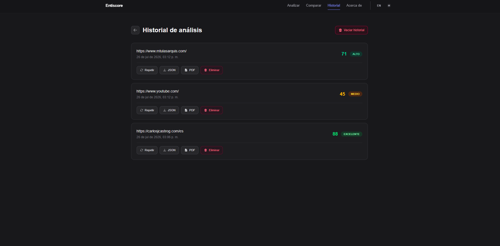

### Sistema de códigos únicos y compartibles

- Cada análisis y cada comparativa genera automáticamente un código corto legible (formato adjetivo-sustantivo-numero, por ejemplo "bold-key-742").
- Ruta pública /r/[codigo] que permite acceder al reporte completo o comparativa sin necesidad de volver a ejecutar el análisis.
- Persistencia en Supabase con Row Level Security (lectura pública por código, escritura solo desde el servidor con service role key).
- Pagina /buscar para consultar un resultado ingresando el codigo manualmente, con o sin guiones, con pantalla de carga propia mientras se resuelve la busqueda y redireccion automatica al reporte si el codigo existe.

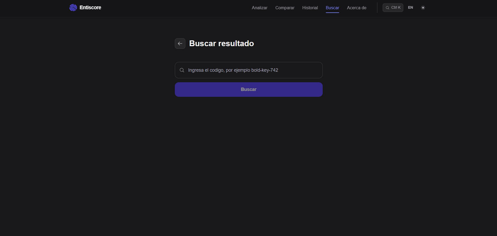

### Compartir resultados

- Botón de compartir con menú desplegable para múltiples canales.
- Copiar enlace al portapapeles con feedback visual.
- Compartir por WhatsApp, X (Twitter), LinkedIn y correo electrónico con texto prearmado contextual.
- Web Share API nativa en dispositivos que la soporten.
- Insignia descargable como imagen PNG con score, dominio, fecha y marca.
- Snippet de Markdown copiable para incrustar la insignia en un README.

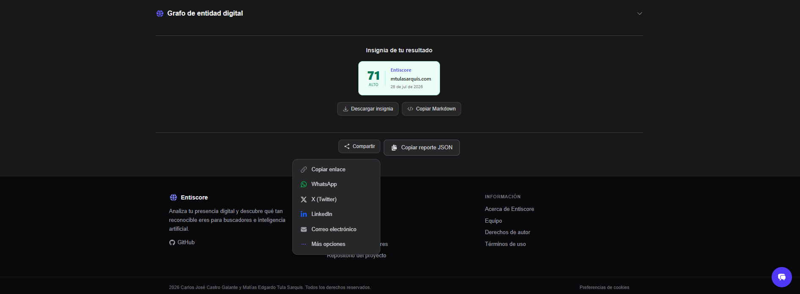

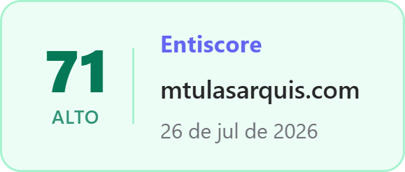

### Asistente conversacional

- Panel de chat con Claude AI contextualizado al análisis o comparativa que se está viendo.
- Streaming de respuestas en tiempo real.
- Formato enriquecido con markdown (listas, negritas, encabezados, bloques de código).
- Capacidad de adjuntar archivos (.txt, .html, .md) para análisis complementario.
- Validación estricta de archivos: detección de tipo real por magic bytes, límite de 2 MB, sanitización con DOMPurify.
- Procesamiento en memoria sin persistencia del contenido del archivo.
- Reglas estrictas del system prompt: solo responde sobre el análisis, no inventa datos, rechaza temas ajenos, resiste inyección de prompts, no usa emojis.

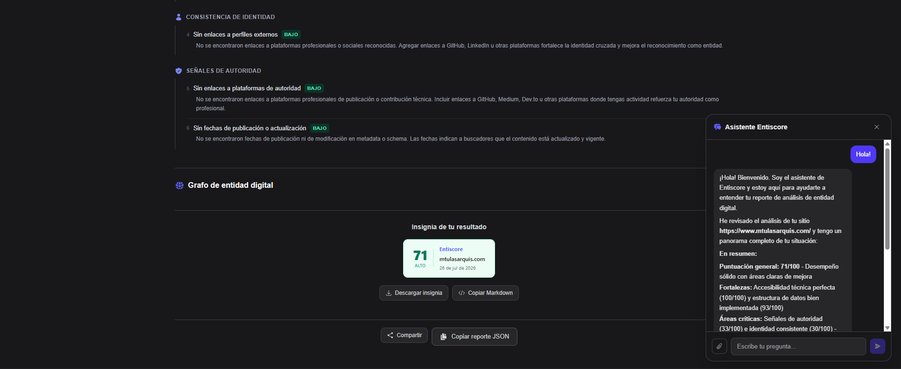

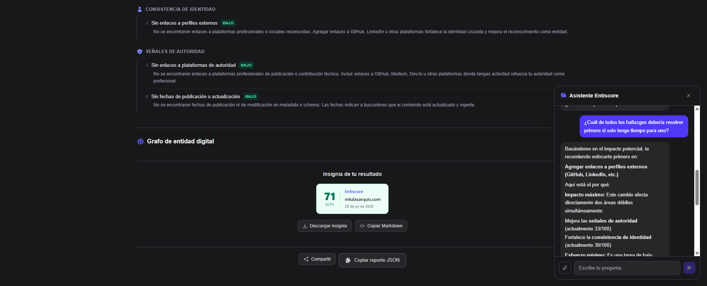

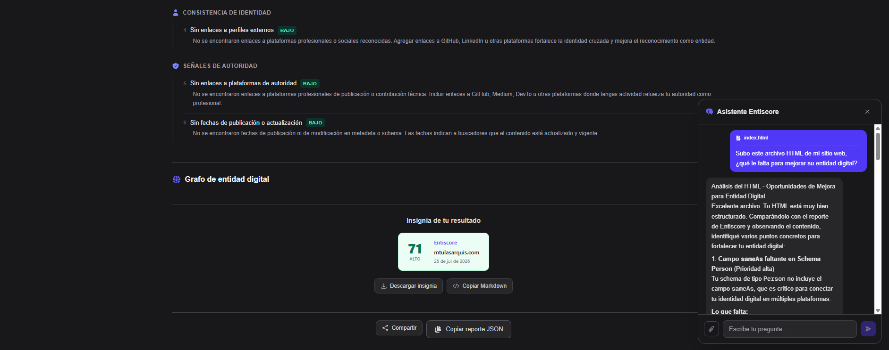

### Interfaz y experiencia

- Hero animado con icosaedro wireframe en Three.js y efecto de escaneo.
- Modo claro y oscuro con persistencia en localStorage y detección de preferencia del sistema.
- Pantalla de carga inicial con animación secuencial de puntos.
- Sección explicativa con los cuatro ejes y chips de URL de ejemplo para prueba rápida.
- Narración en vivo del progreso del análisis con pasos secuenciales tipo Linear.
- Navegación global con navbar minimalista, enlace activo con subrayado animado, y menú mobile como overlay sin desplazamiento del contenido, con ícono de hamburguesa animado por CSS.
- Notificaciones tipo toast al cambiar de tema o idioma, con confirmación del estado resultante.
- Footer con enlaces a todas las secciones y páginas institucionales.
- Banner de cookies respetuoso de la privacidad.
- Command palette accesible con Ctrl+K o Cmd+K, con navegacion completa por teclado para saltar a cualquier seccion o cambiar idioma y tema sin usar el mouse.
- Diseño editorial minimalista sin exceso de tarjetas ni bordes redondeados.

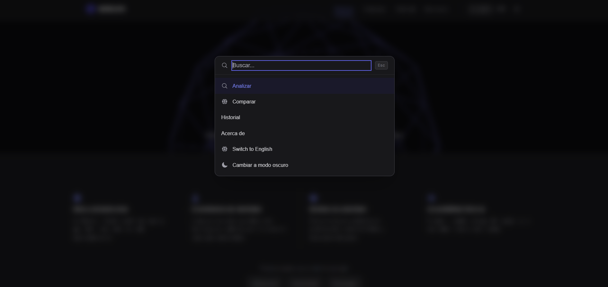

### Páginas institucionales

- /acerca-de: qué es, a quién va dirigido, qué problema resuelve, propósito.
- /equipo: integrantes con roles y enlace a GitHub.
- /derechos-de-autor: aviso de propiedad intelectual.
- /terminos-de-uso: condiciones de uso del servicio.

---

## Cómo se construyó con Kiro

Este proyecto se desarrolló íntegramente usando Kiro como copiloto de desarrollo, demostrando sus capacidades en todo el flujo de trabajo.

### Specs (Spec Driven Development)

Se generaron tres documentos formales antes de escribir cualquier línea de código de implementación:

- `.kiro/specs/requirements.md`: historias de usuario con criterios de aceptación, prioridades P0/P1, versiones simplificadas como alternativa, y requisitos no funcionales.
- `.kiro/specs/design.md`: arquitectura general, contrato completo del endpoint /api/audit con interfaces TypeScript, diseño de la integración de herramientas siguiendo el contrato MCP, separación de capas, manejo de errores, y plan de despliegue.
- `.kiro/specs/tasks.md`: desglose de tareas ejecutables con dependencias entre sí, estimaciones de tiempo, y criterios de completitud por tarea.

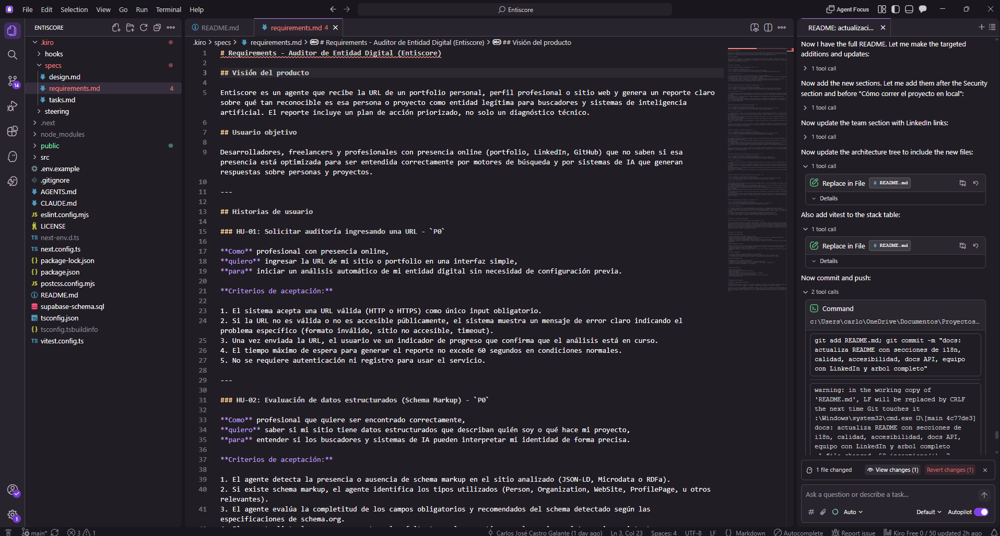

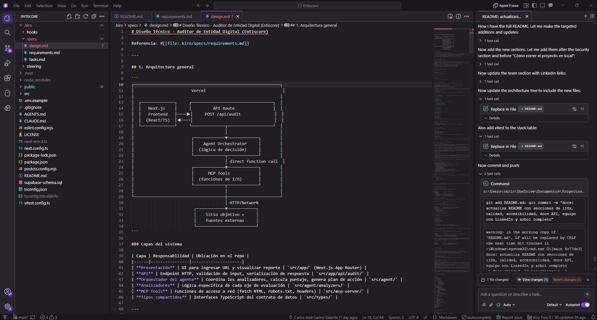

### Steering

El archivo `.kiro/steering/coding-standards.md` define los estándares que Kiro aplica automáticamente a todo el código generado durante el desarrollo:

- Prohibición absoluta de comentarios dentro del código.
- Nombres autodescriptivos que reemplazan la necesidad de comentarios.
- Tipado estricto sin uso de any ni aserciones de tipo injustificadas.
- Una sola responsabilidad por función, con límite de 30 líneas de lógica.
- Separación estricta entre capas: la lógica del agente no ejecuta I/O directamente.
- Convención de commits en español con prefijos tipados (feat, fix, chore, refactor, docs).

### Hooks

El hook `.kiro/hooks/typecheck-on-save.json` ejecuta `npx tsc --noEmit` automáticamente al guardar cualquier archivo TypeScript, garantizando que el proyecto compila sin errores de tipos en todo momento durante el desarrollo.

### MCP Tools

Las herramientas de acceso a datos externos (fetchPage, fetchRobotsTxt, checkUrlAccessibility) se implementaron como funciones TypeScript que respetan el contrato de input/output del Model Context Protocol. El archivo `src/mcp-server/index.ts` expone estas mismas funciones como servidor MCP real usando el SDK oficial, permitiendo su uso desde Kiro IDE durante el desarrollo.

---

## Stack tecnológico

| Componente | Tecnología |
|---|---|
| Framework | Next.js 16 (App Router, Turbopack) |
| Lenguaje | TypeScript (strict mode, noUncheckedIndexedAccess) |
| Estilos | Tailwind CSS 4 |
| Persistencia | Supabase (PostgreSQL, Row Level Security) |
| Inteligencia artificial | Claude API (claude-haiku-4-5-20251001) |
| HTML Parsing | Cheerio |
| Validación | Zod |
| PDF | jsPDF |
| Captura de imagen | html-to-image |
| Markdown en UI | react-markdown |
| 3D | @react-three/fiber, @react-three/drei, Three.js |
| Iconos | react-icons |
| Sanitización | DOMPurify |
| Detección de tipo | file-type |
| Testing | vitest |
| Deploy | Vercel |

---

## Por qué no se usó AWS

El hackathon permite y valora AWS como plus opcional. Este proyecto decidió priorizar Vercel para el despliegue y Supabase para persistencia por razones prácticas: simplicidad de setup, velocidad de iteración, y ausencia de créditos de AWS disponibles para el equipo. La decisión se documentó desde el diseño técnico como restricción conocida y aceptada.

---

## Arquitectura del proyecto

El sistema está organizado en capas con responsabilidades claramente separadas. La capa de presentación (Next.js App Router) maneja la interfaz web y los route handlers HTTP. La capa de API expone tres endpoints: /api/audit para análisis individuales, /api/compare para ejecutar dos análisis en paralelo y guardar la comparativa con su código único en Supabase desde el servidor, y /api/chat para el asistente conversacional con streaming. El agente orquestador coordina la ejecución de los cuatro analizadores en paralelo (datos estructurados, consistencia de identidad, señales de autoridad, accesibilidad técnica), calcula el puntaje ponderado y genera el plan de acción. Las herramientas de acceso a datos externos (fetchPage, fetchRobotsTxt, checkUrlAccessibility) encapsulan toda operación de red siguiendo el contrato de MCP. Supabase provee la persistencia para análisis y comparativas compartibles. Claude API genera el plan de acción con código de solución, el resumen ejecutivo, y las respuestas del asistente conversacional.



Ver en producción: https://entiscore.vercel.app/docs/architecture-diagram.svg

```
src/
├── app/                   Presentación (Next.js App Router)
│   ├── api/audit/         Endpoint POST /api/audit
│   ├── api/compare/       Endpoint POST /api/compare (orquesta ambos análisis, guarda comparativa en Supabase con código único)
│   ├── api/chat/          Endpoint POST /api/chat (streaming)
│   ├── components/        Componentes React del reporte y UI
│   ├── comparar/          Página de comparación
│   ├── buscar/            Búsqueda de resultado por código
│   ├── historial/         Página de historial
│   ├── api-docs/          Documentación pública de la API
│   ├── r/[codigo]/        Ruta pública para reportes compartidos
│   ├── acerca-de/         Página institucional
│   ├── equipo/            Página institucional
│   ├── derechos-de-autor/ Página institucional
│   ├── terminos-de-uso/   Página institucional
│   ├── lib/               Utilidades del cliente (historial, PDF)
│   ├── sitemap.ts         Generador de sitemap.xml
│   └── robots.ts          Generador de robots.txt
├── agent/                 Lógica del agente
│   ├── orchestrator.ts    Coordinación del análisis
│   ├── scoring.ts         Cálculo de puntaje ponderado
│   ├── scoring.test.ts    Tests unitarios de scoring
│   ├── action-plan.ts     Plan de acción basado en reglas
│   ├── action-plan.test.ts Tests unitarios del plan de acción
│   ├── action-plan-ai.ts  Plan de acción generado por Claude
│   ├── executive-summary.ts  Resumen ejecutivo generado por Claude
│   ├── shared-platforms.ts   Dominios reconocidos compartidos
│   └── analyzers/         Un analizador por eje
├── mcp-server/            MCP tools (funciones de I/O de red)
│   ├── index.ts           Servidor MCP de referencia
│   └── tools/             fetchPage, fetchRobotsTxt, checkUrlAccessibility
├── i18n/                  Internacionalización
│   ├── types.ts           Tipos del diccionario
│   ├── es.ts             Diccionario español
│   ├── en.ts             Diccionario inglés
│   ├── context.tsx        Provider y hooks de React
│   ├── findings.ts        Traducciones de findings por clave
│   └── server.ts          Lectura de locale desde cookies del servidor
├── lib/                   Utilidades del servidor
│   ├── supabase.ts        Cliente público (lectura)
│   ├── supabase-server.ts Cliente privado (escritura, service role)
│   ├── persistence.ts     Guardado y recuperación de análisis
│   ├── code-generator.ts  Generación de códigos únicos
│   ├── site-metadata.ts   Extracción de favicon y nombre del sitio
│   ├── file-validation.ts Validación estricta de archivos
│   ├── url-validation.ts  Validación estricta de URLs
│   └── rate-limiter.ts    Rate limiting por IP en memoria
└── types/                 Interfaces TypeScript compartidas
```

---

## Casos de uso

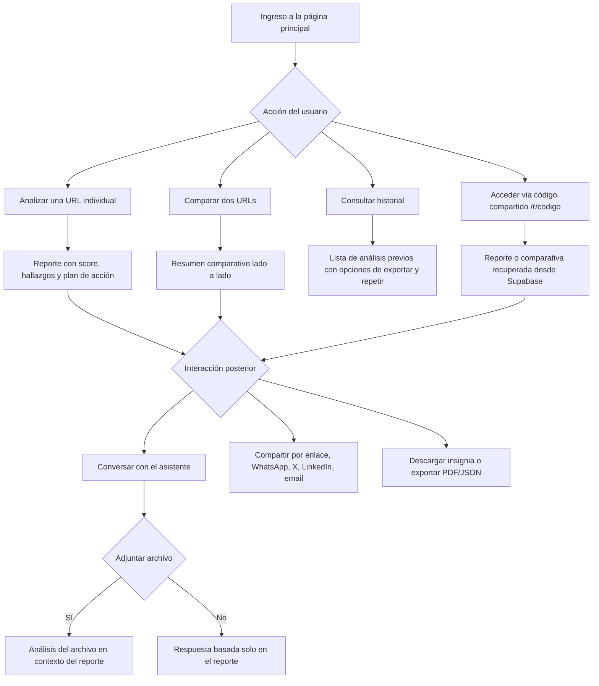
```mermaid
flowchart TD
    A[Ingreso a la página principal] --> B{Acción del usuario}
    B --> C[Analizar una URL individual]
    B --> D[Comparar dos URLs]
    B --> E[Consultar historial]
    B --> F[Acceder via código compartido /r/codigo]

    C --> G[Reporte con score, hallazgos y plan de acción]
    D --> H[Resumen comparativo lado a lado]
    E --> I[Lista de análisis previos con opciones de exportar y repetir]
    F --> J[Reporte o comparativa recuperada desde Supabase]

    G --> K{Interacción posterior}
    H --> K
    J --> K

    K --> L[Conversar con el asistente]
    K --> M[Compartir por enlace, WhatsApp, X, LinkedIn, email]
    K --> N[Descargar insignia o exportar PDF/JSON]

    L --> O{Adjuntar archivo}
    O -->|Sí| P[Análisis del archivo en contexto del reporte]
    O -->|No| Q[Respuesta basada solo en el reporte]
```

**Analizar una URL individual:** El usuario ingresa una URL, el sistema la analiza en los cuatro ejes, genera un puntaje, un resumen ejecutivo por IA, y un plan de acción con código de solución. El resultado se guarda con un código único compartible.

**Comparar dos URLs:** Ambos análisis se ejecutan en paralelo contra el mismo endpoint, generando un resumen comparativo que indica cuál sitio tiene mejor resultado por eje y en general.

**Consultar historial:** Los análisis realizados se guardan en localStorage (si se aceptaron cookies) con opción de repetir, exportar a JSON o PDF, y eliminar.

**Acceder via código compartido:** Cualquier persona con el código puede ver el reporte completo o la comparativa desde la ruta pública /r/[codigo], sin necesidad de repetir el análisis.

**Conversar con el asistente:** Un panel de chat contextualizado al reporte permite preguntar sobre hallazgos específicos, pedir recomendaciones detalladas, o adjuntar un archivo para análisis complementario. El contenido del archivo se procesa en memoria sin persistencia.

---

## Seguridad

### Protección SSRF

El endpoint /api/audit valida cada URL contra rangos de IP privados (127.0.0.0/8, 10.0.0.0/8, 172.16.0.0/12, 192.168.0.0/16, 169.254.0.0/16, ::1) y hostnames bloqueados (localhost) antes de ejecutar cualquier operación de red. Se resuelve DNS del hostname para detectar redirecciones a direcciones internas.

### Separación de clientes Supabase

- Cliente público (anon key): solo para lecturas por código desde la ruta /r/[codigo].
- Cliente privado (service role key): solo para inserciones desde route handlers del servidor. Nunca se expone al cliente.

### Validación de archivos adjuntos

- Límite estricto de 2 MB verificado en servidor.
- Detección de tipo real por magic bytes con file-type (no confía en extensión ni Content-Type declarado).
- Lista blanca de tipos: solo texto plano, HTML y Markdown.
- Rechazo explícito de archivos comprimidos.
- Procesamiento en memoria sin persistencia.
- Sanitización con DOMPurify antes de mostrar nombres en la interfaz.
- System prompt reforzado contra inyección via contenido del archivo.

---

## Internacionalización

El sitio funciona completo en español e inglés. Un selector de idioma en la navbar permite cambiar entre ambos idiomas con persistencia en localStorage y cookie para el servidor. La traducción abarca toda la interfaz (navbar, footer, formularios, páginas institucionales, historial, comparación, búsqueda por código), los mensajes de error del servidor, los findings generados por los cuatro analizadores (resueltos dinámicamente según el idioma recibido en la request), y el contenido generado por Claude (plan de acción, resumen ejecutivo, respuestas del asistente), que recibe una instrucción explícita de idioma en cada prompt.


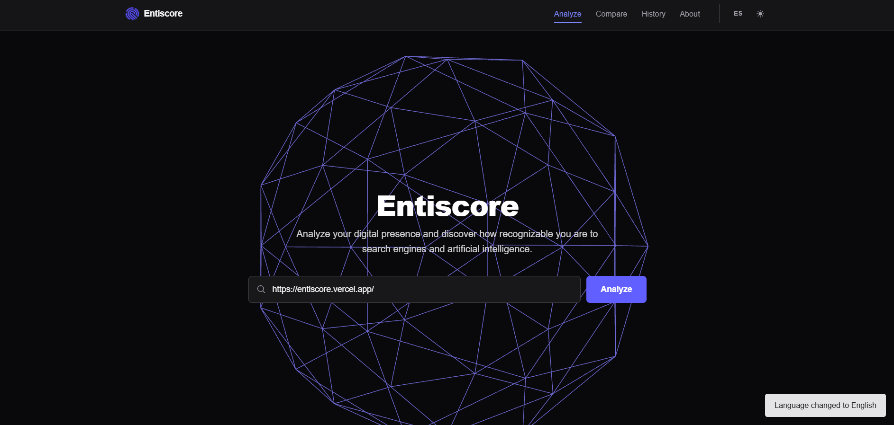


---

## Calidad y confiabilidad

### Tests unitarios

El proyecto incluye tests unitarios con vitest cubriendo la lógica de scoring (cálculo de promedio ponderado, exclusión de ejes con status failed o partial, redistribución de pesos, mapeo correcto a cada nivel de maturityLevel) y la generación del plan de acción por reglas (priorización de critical sobre warning, orden por peso de eje, garantía de mínimo 3 recomendaciones).

```bash
npm test
```

### Rate limiting

Los endpoints /api/audit y /api/compare implementan un límite básico de 5 requests por minuto por IP. Al superar el límite se devuelve un código 429 con el mensaje correspondiente. La implementación es in-memory, lo cual es una limitación conocida: el conteo no se comparte entre instancias serverless distintas en Vercel, pero es suficiente para prevenir abuso desde una misma instancia.

---

## Accesibilidad

El sitio es navegable completamente por teclado, incluyendo la apertura y cierre del menú mobile y la interacción completa con el panel de chat (escribir, enviar, adjuntar archivo). Todos los botones que solo muestran un ícono sin texto visible tienen atributos aria-label descriptivos. El foco del teclado es visible en ambos modos de color con un outline indigo de 2px aplicado globalmente via focus-visible. El contraste de color entre texto y fondo fue revisado en ambos modos para mantener legibilidad en todas las combinaciones.

---

## Documentación para desarrolladores

La ruta /api-docs documenta el uso del endpoint POST /api/audit para integraciones externas, con el formato de request, la estructura completa de respuesta, los códigos de error posibles, y ejemplos ejecutables con curl y fetch de JavaScript. El endpoint no requiere autenticación en esta versión.

---

## Cómo correr el proyecto en local

```bash
git clone https://github.com/carlosjcastro/entiscore.git
cd entiscore
npm install
```

Crear un archivo `.env.local` basado en `.env.example`:

```env
NODE_ENV=development
ANTHROPIC_API_KEY=tu-api-key-de-anthropic
NEXT_PUBLIC_SUPABASE_URL=tu-url-de-supabase
NEXT_PUBLIC_SUPABASE_ANON_KEY=tu-anon-key
SUPABASE_SERVICE_ROLE_KEY=tu-service-role-key
```

Para el análisis básico sin IA ni persistencia, solo se necesita `NODE_ENV`. El asistente conversacional, el plan de acción generado por IA y el resumen ejecutivo requieren `ANTHROPIC_API_KEY`. La persistencia con códigos compartibles requiere las variables de Supabase.

```bash
npm run dev
```

El proyecto levanta en `http://localhost:3000`.

---

## Equipo

| Integrante | Rol | Enlaces |
|---|---|---|
| Carlos José Castro Galante | Lógica del agente, integración con IA, arquitectura, integración con Kiro | [GitHub](https://github.com/carlosjcastro) · [LinkedIn](https://www.linkedin.com/in/carlosjcastrog) |
| Matías Edgardo Tula Sarquis | Diseño de interfaz y experiencia de usuario | [LinkedIn](https://www.linkedin.com/in/mat%C3%ADas-edgardo-tula-sarquis/) |

Ver más en https://entiscore.vercel.app/equipo

---

## Licencia y derechos

El nombre Entiscore, el diseño visual, la paleta de colores, la identidad de marca y el código fuente son propiedad de Carlos José Castro Galante y Matías Edgardo Tula Sarquis.

Detalle completo en https://entiscore.vercel.app/derechos-de-autor

---

## Enlaces

- **Demo en producción:** https://entiscore.vercel.app
- **Repositorio:** https://github.com/carlosjcastro/entiscore
- **Video de presentación:**


<div align="center">
  
</div>